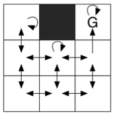

[](https://classroom.github.com/a/lFs6HoBD)


# RL Lecture - Exercise 05

---

## Q-learning: Pen and Paper



Consider the deterministic MDP in Figure 1. There exists a terminal state $G$ and a wall that cannot be entered. The agent remains in its current position if it chooses an action that moves it against the wall or off the grid. All transitions have a reward of $-1$. We discount with $0.5$.

Please think and write: 

* How is the Q-learning update defined for a transition from state $i$ to $j$, if $j$ is a terminal state?
* We initialize all Q-values with $0$. The agent starts in the upper left corner. It then moves one cell down, then one cell to the right and tries unsuccessfully to move one cell upwards (i.e. remains in its current cell), then moves one cell to the right and finally moves upwards into the terminal state. Which values of the Q-function change during this episode if we apply Q-learning with a learning rate of $1.0$? Calculate the updated Q-function after this first episode. Repeat the calculation for a second identical episode.
* Calculate the optimal Q-values $Q^*(s,a)$ for all state-action pairs.

## Q-learning: Implementation

This task is based on the Cliff Walking example from Richard Sutton's [RL book](http://incompleteideas.net/book/RLbook2018.pdf) page 154. We have already prepared a complete implementation of the environment, which can be found in `cliff_walking.py`. All that is left to do for you is to implement the
Q-learning algorithm and epsilon greedy method  in `q_learning.py` : 

```python
make_epsilon_greedy_policy(Q, epsilon, nA) 
q_learning(env, num_episodes, discount_factor=1.0, alpha=0.5, epsilon=0.1)
```

You find the tests in `test_exercise05.py`. Run them by:

```
pytest test_exercise05.py
```

Additionally, you will find a visualization script for the predicted value functions. To use it, you need [matplotlib](https://matplotlib.org/users/installing.html). Run it using: 

```python
python visualization.py
```

---

## Submission Instructions

- Upload your solution by adding a file `exercise05.pdf`. You can upload handwritten notes or do your submission via latex.
- Implement the tasks in `q_learning.py`;
- (Possibly) test them locally with `pytest test_exercise05.py` and `pthon visualization.py`;
- Push your changes to the GitHub server;
- See the testing results in Actions page;
- Raise questions and feedback in Pull Requests page;
- Share your experiences in the forum.

---

**Supervisors:** Prof. Joschka Boedecker, Dr. Gabriel Kalweit, Philipp Bordne, Julien Brosseit, Jasper Hoffmann, Yuan Zhang


